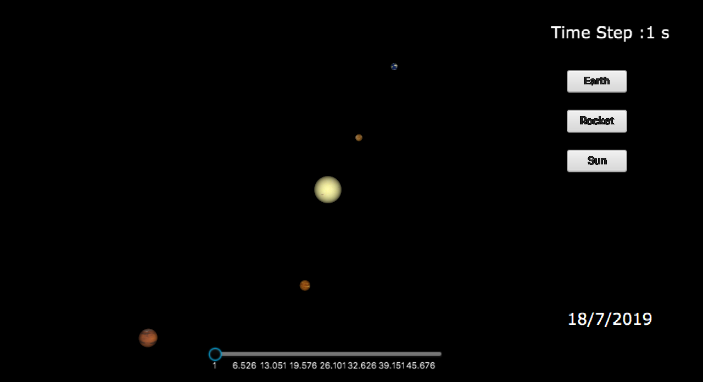

# Titanic Space Odyssey
This project consists in implementing the solar system using systems of differential equations and compute the trajectory of a rocket to titan. <br> <br>

## Data for Celesital Bodies
The data for both positions and velocities have been taken from https://ssd.jpl.nasa.gov/horizons.cgi and then transformed into 3-dimensional vectors. 
## Euler's method for planetary motions
To fit and approximate Newton's law of gravity we used Euler's method. Its accuracy is not great :cry: since it is a first-order solver. Though it is easy to implement.
## Higher order methods
To get better results on their positions we used a 4th order Runge-Kutta method. It is a well famous system of differential equations. It consists in taking steps for each iteration so that the accuracy is improved. The equation for solving it is <br>
<br>


## Run the code
Intellij is required to build this project.
unzip\
Set the project structure so that the src folder is the source of the project

We have two different codes to run.
Launcher contains both the solar system and the trajectory to titan
```bash
java Launcher
```
then run GUILandind.java file to see the landing on Titan
```bash
java GUILanding
```
